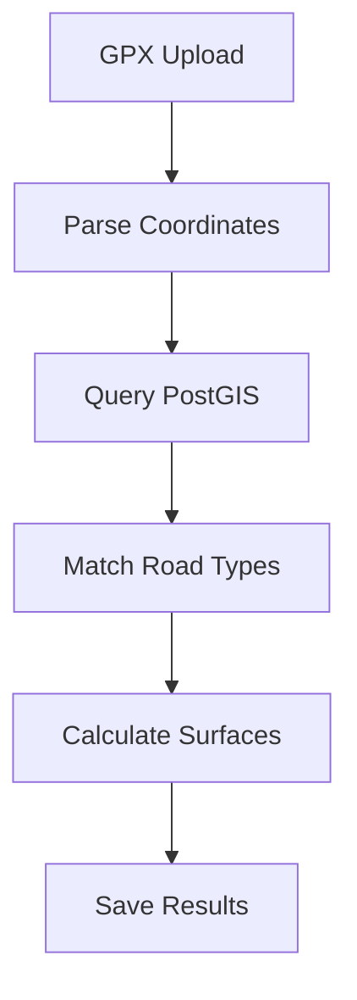

# Project Context

## Current Issues (lutruwita2)

### Performance Problems
- Map container (1200+ lines) causing render delays
- Surface detection taking 8-10s for 50km routes
- Photo uploads failing above 3MB
- Route saving timeout with >100 waypoints

### User Pain Points
- "Surface detection unreliable on gravel roads"
- "App crashes with large GPX files"
- "Can't save long routes reliably"
- "Photos take too long to load"

### Technical Debt
- Monolithic components (map-container.tsx: 1200 lines)
- Mixed concerns in server.ts (800+ lines)
- Duplicate state management
- No error boundaries
- Minimal testing

## Technical Requirements

### Browser Support
- Modern browsers (last 2 versions)
- Mobile Safari/Chrome
- No IE11 support needed
- PWA capabilities required

### Performance Targets
- First Contentful Paint: <2s
- Time to Interactive: <3s
- Route Processing: <3s (was 8-10s)
- Photo Upload: <2s (was 5-7s)

### Surface Detection
Current Process:

Issues:
- PostGIS queries timeout
- Incorrect surface matching
- No caching layer
- Poor error handling

New Approach:
- Batch processing
- Surface caching
- Better error handling
- Improved algorithms

### Database Requirements
Current Issues:
- MongoDB timeouts with large routes
- No indexing on location queries
- Memory issues with photo storage

Solutions:
- Proper indexing
- Batch operations
- DO Spaces for photos
- Caching layer

### Accessibility
- WCAG 2.1 AA compliance
- Keyboard navigation
- Screen reader support
- Color contrast requirements

### SEO Requirements
- Server-side rendering
- Meta tags for routes
- Sitemap generation
- Social sharing support

## Migration Strategy

### MVP (4 weeks)
1. Basic map display
2. Simple route creation
3. Basic surface detection
4. Photo uploads
5. User profiles

### Phase 2 (4 weeks)
1. Advanced surface detection
2. Route optimization
3. Photo management
4. Social features

### Technical Goals
- File size limits enforced
- 90%+ test coverage
- TypeScript strict mode
- Performance monitoring
- Error tracking

## Development Guidelines

### Code Standards
- Max file sizes:
  - Components: 100 lines
  - Services: 150 lines
  - Tests: 200 lines
  
### Review Process
- Performance impact
- Bundle size changes
- Test coverage
- Accessibility check

### Documentation
Required for all features:
- Technical specs
- User documentation
- API documentation
- Test coverage report

## Infrastructure
Current Issues:
- DigitalOcean basic tier
- No CDN
- Single region
- Limited monitoring

New Setup:
- DO Premium
- Cloudflare CDN
- Multi-region DB
- Full monitoring

See IMPLEMENTATION_PLAN.md for detailed steps.