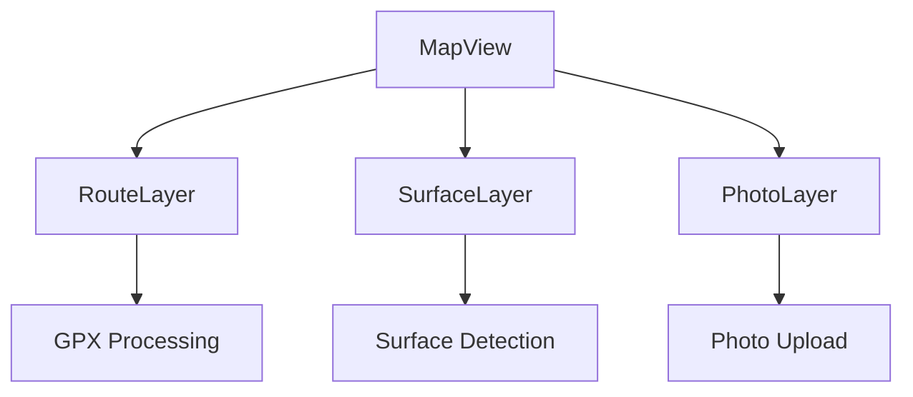

# Lutruwita Map

Complete rebuild of lutruwita2 focusing on maintainability and performance.

## Project Status
Migration from lutruwita2 (github.com/vinmasci/lutruwita2)
- [ ] Phase 0: Architecture Setup
- [ ] Phase 1: Project Setup
- [ ] Phase 2: Core Features
- [ ] Phase 3: Server Setup
- [ ] Phase 4: Testing

## Improvements Over lutruwita2
| Feature | lutruwita2 | lutruwita_map |
|---------|------------|---------------|
| File Size | 1000+ line components | Max 100 lines |
| State | Mixed/scattered | Zustand + Context |
| Testing | Minimal | Full coverage |
| TypeScript | Partial | Strict mode |
| Architecture | Monolithic | Feature modules |

## Core Features
- Interactive map with custom styling
- Route creation and GPX import
- Surface type detection (paved/unpaved)
- Location-based photo sharing
- Custom points of interest
- User profiles and saved maps

## Architecture
```
src/
  features/           # Core functionality
    maps/            # Map/route features
    photos/          # Photo management 
    auth/            # Authentication
  shared/            # Reusable code
  lib/               # Core utilities
  app/               # Application entry
```

## Component Flow


## Tech Stack
- Frontend: React 18 + TypeScript
- Maps: Mapbox GL 
- State: Zustand + Context
- Backend: Express + MongoDB
- Storage: DO Spaces
- Auth: Auth0

## Development Setup

1. Clone repository:
```bash
git clone https://github.com/vinmasci/lutruwita_map.git
cd lutruwita_map
```

2. Install dependencies:
```bash
npm install
```

3. Environment setup (.env.local):
```
VITE_MAPBOX_TOKEN=
AUTH0_SECRET=
AUTH0_CLIENT_SECRET=
VITE_MONGODB_URI=
```

4. Development server:
```bash
npm run dev
```

## Contributing
See IMPLEMENTATION_PLAN.md for current tasks and ARCHITECTURE_PLAN.md for guidelines.